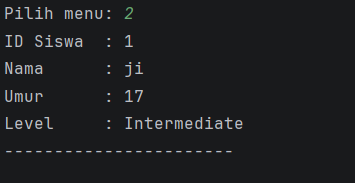
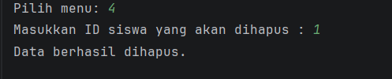
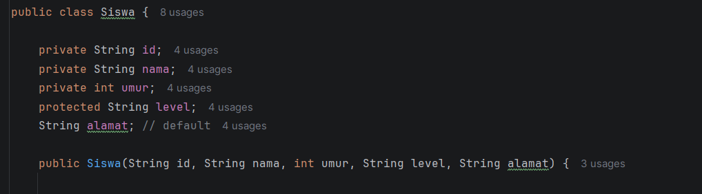
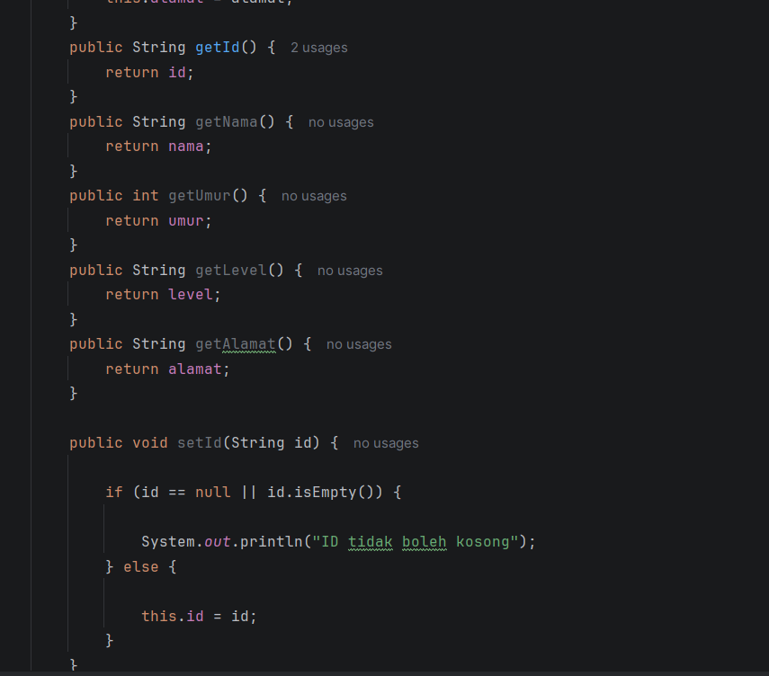
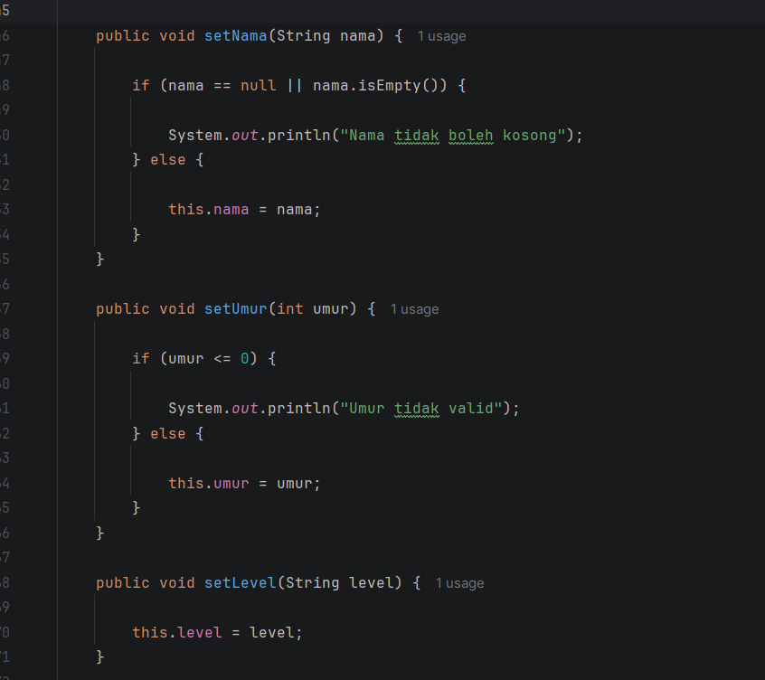
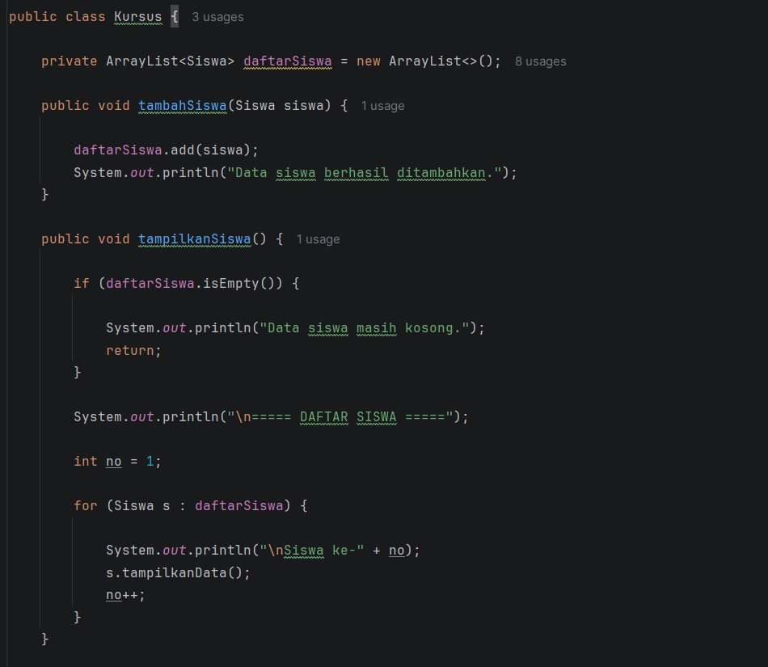

## Menu PROGRAM

## TAMBAH PROGRAM

## Tampilkan PROGRAM

## Update PROGRAM

## Hapus PROGRAM

####################################

## Pengguanaan Encapsulation, Getter dan Setter dan Acces Modifier

## Siswa
## Encapsulation

## Getter

## Setter

## Kursus
